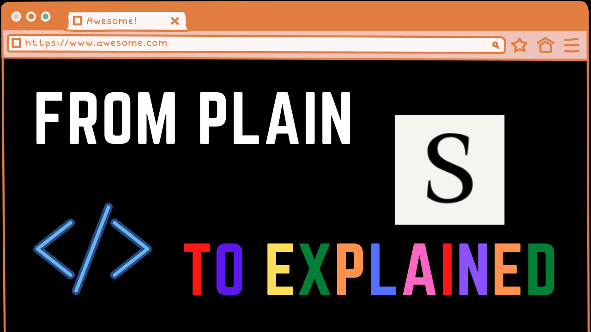
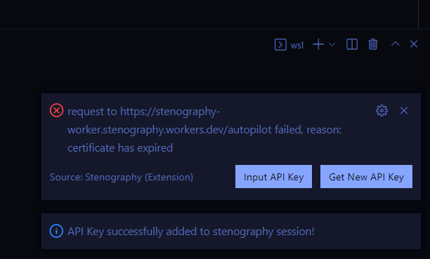
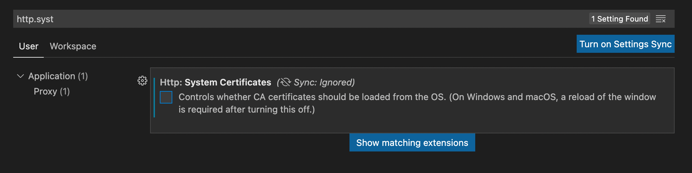
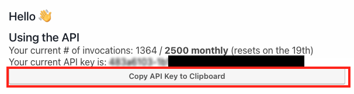
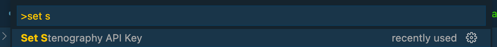

# stenography-autopilot-vsc README

**Watch this video to get set up**

# -->  LINUX AND WINDOWS USERS: READ THIS <---

You may run into an error that looks like this: `certificate has expired`

This error is caused by the Certificate Authority from the OS not reaching VSC. [You can read more about it here.](https://github.com/microsoft/vscode/issues/136787)

TO FIX: Go into VSC settings (Code > Preferences > Settings) and set `http.systemCertificates: false`. Then restart VSC. It should work after this!

[Don't hesitate to contact us if you have any questions about this.](mailto:bram+feedback@stenography.dev)

## [Get the Extension on the VSC Marketplace](https://marketplace.visualstudio.com/items?itemName=Stenography.stenography)

Leverage the [Stenography Autopilot API](https://bramses.notion.site/bramses/Stenography-Documentation-08e26294e93a48c09ea5bdf3a78ded00#74e2cb7e877840c3a9fa0a3ca53961ab) to automatically comment your code files in VSC.

Current language support:
- Javascript
- Typescript
- TSX
- Python
- HTML
- Ruby
- Vue
- Solidity
- JSX

New languages are continously being added! [Follow Stenography on Twitter](https://twitter.com/StenographyDev) to be kept up to date about new languages. 

## Installation

### Video

### Text

1. Copy your API key using the `Copy API Key to Clipboard` button from the [Stenography Dashboard](https://stenography.dev/dashboard)

2. Input your API Key in the VSC extension: `Cmd + Shift + P` -> `Set Stenography API Key`

## Running

### CodeLens Mode

CodeLens Mode should run automatically, but can be turned on and off with `Toggle Stenography Code Lens` command

These small gray lines with the text `<stenography autopilot />` will populate your code on the CodeLens layer. These CodeLenses will auto update whenever you save the document.
They will also save to a cache if the code hasn't changed allowing you to see the prior invocation without having to call it again.

*Looking for feedback* should this mode tell you where the codelens lines are being added? [Contact me and let me know your thoughts!](mailto:bram+feedback@stenography.dev)

### Comment Mode

1. On a valid file, hit `ctrl(windows)/cmd(mac) + shift + p` and run `Stenography Autopilot - Dry Run` to see where the AI will comment your code. This **won't** cost any API invocations.
2. Remove dry run comments by hitting **undo twice (see Known Issues below)**
3. Run Stenography! `ctrl(windows)/cmd(mac) + shift + p` and run `Stenography Autopilot`. This **will** cost API invocations.
4. To select all comments Stenography generated, use this regex pattern: `(\/\*\n{1})(.|\n)+?(\]\s*\n\s*\*\/)`

## Requirements

- VSC
- Stenography API Key

## Extension Settings

This extension contributes the following settings:

* `stenography.apiKey`: **[REQUIRED]** set your [Stenography API key](https://stenography.dev/dashboard) in vsc settings (`cmd+,`)
* `stenography.autopilotSettings.zeroCol`: documentation to be inserted on the first column, instead of where the code block starts
* `stenography.codeLensMode`: Enable/disable codelens mode (enabled by default)

## Known Issues

- Replacing current comments above code blocks. Currently Stenography does not replace/overwrite comments due to edge cases of overwriting code that people wrote manually. It will append the newest version one line above the code block (run dry-run to see where Stenography will comment)
- The empty lines above code blocks. The VSC editor is `thenable` and in order to add explanations correctly, a new line has to be inserted **before** the code block comment is.
- The Codelens API call can cause slowdown if you have multiple tabs open. The reason for this is that ranges and commands are both resolved in the API call. [Open bug bounty fix!](https://stackoverflow.com/questions/70058746/async-call-result-provides-ranges-and-command-for-codelens)
- Multiple save presses while one call is in flight will call the other as well. Current solution is to only hit save once while Stenography is in flight.
- Initial file loads will cause CodeLens to take a while to show up, and then you may need to lose context of file and go back to see CodeLens
- Extension Crash (may be due to cache or codelens) -- unsure (as of v1.1.7)

## Release Notes

### 1.0.0

Initial release of Stenography Extension!

### 1.0.1

- Added HTML to list of supported languages
- Added a setting that allows documentation to be inserted on the first column, instead of where the code block starts

### 1.0.2

- Added TSX to list of supported languages
- More information boxes and error boxes

### 1.0.3

- Added `Stenography API Key command`
- Added **[experimental]** code lens mode
- Adjusted comment blocks so that all start lines line up

### 1.0.4

- Added support for Ruby

### 1.0.41

- Ruby and Python single quote fix

### 1.1.0

- Codelens mode is live! Runs on new file and file save. Can be toggled with `Toggle Stenography Code Lens`
- Click on CodeLens to see result, and press the `speak` button to have Stenography describe function to you

### 1.1.1

- Fixed bug where cache gets stuck on max invocations. Can be cleared by toggling Codelens off and on again.
- Fixed escape regex bug when text was null

### 1.1.2

- Small README updates

### 1.1.3

- cache is now more up to date, and less stale when `Reset Cache` is called
- `Reset Cache` now works lol
- `speak` is gone
- `Write to File` takes Steno response and commits it to file as a comment. *Hint: use `zeroCol` setting to move it to col zero*

### 1.1.4

- debounced saving so only one Stenography can be in flight

### 1.1.5

- cache timeout for better UX when cache is slow
- added max comment width when sharing or committing to file
- `commentGenerator` == idempotent comment generator for Stenography VSC

### 1.1.6

- `vue` added to supported languages

### 1.1.7

- removed await from cache and lean on timeout

### 1.1.8

- added setting `stenography.generatedBy` which allows for users to turn on and off the `- generated by stenography autopilot [ 🚗👩‍✈️ ]` line

### 1.1.9

- fixed `maxInvocation` checker to run more freuently, and correctly unblock processing flag

### 1.2.0

- `node-fetch()` -> `axios`. Should hopefully adress any certificate expiration issues. [Please reach out to me if you are still experiencing this bug](mailto:bram+feedback@stenography.dev)
*Huge thanks to AxiomaAbsurdo for helping me find this bug!!*

### 1.2.1

- README update for `http.systemCertificate` error

### 1.2.2

- Solidity added!
- JSX added!